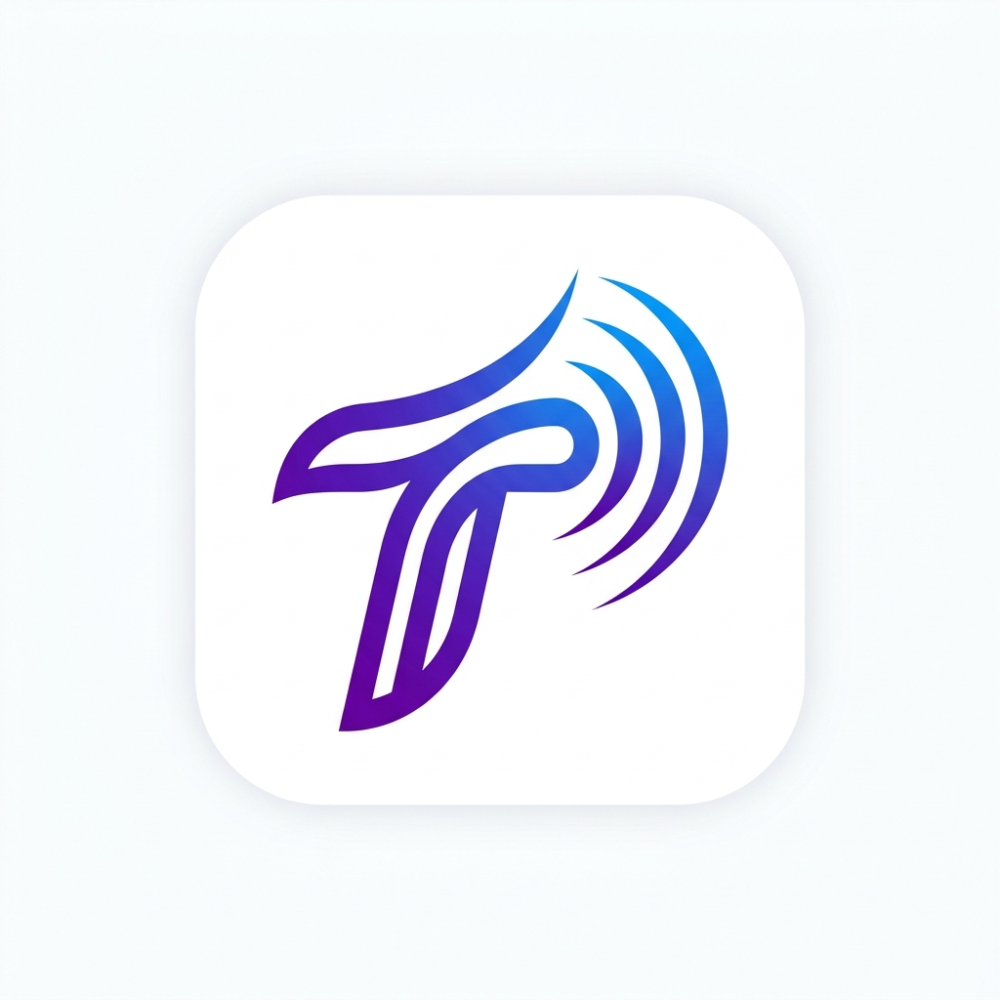

# ⚡ Tech Thump

**Tech Thump** is a premium, real-time Market Intelligence Dashboard tailored for technology professionals. It aggregates the most critical IT industry news, cloud updates, FAANG radar data, and deep-dive company briefings—all cleanly formatted into a premium, hyper-responsive interface. 

The application utilizes an advanced underlying **MCP (Model Context Protocol) Server**, providing a structured data backbone that can instantly scale data extraction from global news APIs, financial simulators, and wikipedia datasets.



## ✨ Core Features

*   **Market Pulse Ticker:** A simulated Wall-Street-style scrolling ticker providing realistic (mock) market data updates for major tech companies, allowing you to bypass expensive commercial API limits while still demonstrating high-end dashboard aesthetics.
*   **Big Tech Radar:** A dedicated module providing laser-focused news filtering on FAANG + top AI companies (Apple, Microsoft, Google, Meta, Amazon, Nvidia, OpenAI). 
*   **Company Intelligence:** A powerful research engine embedded directly in the dashboard. Type in any tech company name to generate a formatted intelligence briefing sourced natively from Wikipedia alongside their most breaking headlines.
*   **Cloud Provider Tracking:** Dedicated feeds for the major cloud providers (AWS, Azure, GCP) to keep you informed of critical service outages or feature drops.
*   **Skill Recommendations:** AI-driven analytics on current market job trends and suggested technical skills to learn based on current demand.
*   **Local Bookmarking:** Save crucial articles entirely in your browser using local storage for offline retrieval.

## 🏗️ Architecture Stack

The project relies on a decoupled, 3-tier architecture:

1.  **Frontend (Vite + Vanilla JS/CSS):** 
    Located in `/src`. An impossibly fast, client-side rendering application that fetches decoupled JSON. Features dynamic glassmorphic UI, smooth CSS transitions, and local caching.
2.  **Proxy Server (Node + Express):**
    Located in `/server`. A micro-Express application acting as an intermediary router, adding caching layers and preventing direct client-side exposure of API keys. 
3.  **MCP Server (Model Context Protocol):**
    Located in `/mcp-server`. A strict TypeScript definition layer for advanced tools. It dictates precisely how external endpoints (GNews API, Wikipedia API, randomized stock generators) provide structured JSON back to the proxy server.

## 🚀 Setup & Local Development

### 1. Prerequisites 
Ensure you have `Node.js` installed on your machine.

### 2. Environment Variables
In the root directory, configure your `.env` variables from `.env.example`:
```bash
# Add your GNews API Key for live articles
GNEWS_API_KEY="your_api_key_here"
```

### 3. Running the Application locally

Because of the architectural separation, you must boot both the proxy server and the client interface:

**Terminal 1: Start the Backend MCP/Express API**
```bash
npm run server
```
*(Runs on `http://localhost:5000`)*

**Terminal 2: Start the Vite Frontend**
```bash
npm run dev
```
*(Runs on `http://localhost:5173`)*

## 🌐 Deployment (Production)

The current project is natively configured for easy cloud-hosted drops tracking independent Git workflows:
- **Frontend:** Deploys instantly to **Netlify** natively watching the root HTML directory.
- **Backend:** Automatically deployed via a **Render** Web Service targeting the Node script `npm run server`. Ensure your `VITE_API_BASE_URL` on Netlify is pointed to the live Render endpoint.

---
*Built with ❤️ utilizing the Gemini Agentic framework.*
